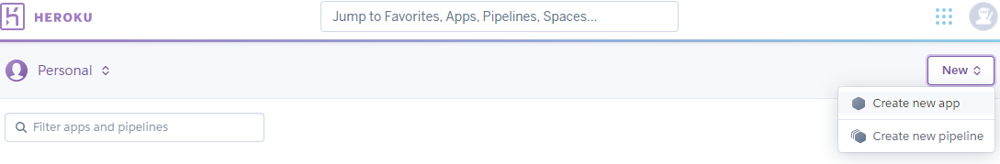

# POSTER PANDA
___

### 

At Poster Panda, we are passionate about interior decoration and design. We offer wide range of stylish high quality posters along with frames and have something to suit every wall. Express yourself by creating a personalized wall of posters! Inspire others and have fun!

### :panda_face: [Live website](https://poster-panda.herokuapp.com/)


# Table of Contents

- [UX](#ux)
  * [Strategy](#strategy)
    + [Project Goals](#project-goals)
    + [Business Goals](#business-goals)
    + [Target Audience](#target-audience)
  * [User Stories](#user-stories)
    + [First-time / casual visitor](#first-time---casual-visitor)
    + [Registered / returning visitor](#registered---returning-visitor)
    + [Store owner / Superuser](#store-owner---superuser)
  * [Scope](#scope)
  * [Structure](#structure)
  * [Skeleton](#skeleton)
  * [Surface](#surface)
- [Technologies Used](#technologies-used)
  * [Languages](#languages)
  * [Frameworks, Libraries and Tools](#frameworks--libraries-and-tools)
- [Features](#features)
  * [Implemented Features](#implemented-features)
  * [Future Features](#future-features)
- [Information Architecture](#information-architecture)
- [Testing](#testing)
- [Deployment](#deployment)
  * [Local Deployment](#local-deployment)
  * [Remote Deployment](#remote-deployment)
- [Credits](#credits)
- [Acknowledgements](#acknowledgements)


# UX
___
## Strategy 

* ### Project Goals
    * To create a fully-optimized responsive site for flawless user experience on all devices.
    * To create a platform that allows all users to purchase stylish and affordable posters and frames.
    * Convert website visitors into registered users to utilize the website to it's full potential. 


* ### Business Goals
    * Achieve sales growth by offering competitively priced, good value products and increase profit.
    * Drive traffic to the site by promoting it on various social media sites and collaborating with influencers.
    * Offer new and exclusive collections every month by collaborating with original photographers and artists.


* ### Target Audience
    * Mainly female audience (around 75% according to the market research data) aged 14-65 who have interest in:
        * Lifestyle, beauty and fashion 
        * Travel and tourism 
        * Art and Design
        * Home and Garden
    * Users looking to buy a trendy gift.

[:top:](#poster-panda)


## User Stories

### First-time / casual visitor

* As a **First-time / casual visitor** I want to be able to:

    * Navigate the site intuitively and easily access all available website features from different screen size devices.
    * See list of all the products offered on the site and use sorting and filters to narrow down the search for posters that I am interested in purchasing.
    * See the new collections and other featured favourites to get inspired and be informed on the latest trends.
    * Search products by name or description to quickly find the product that I need.
    * View individual product details on a separate page including price, image, description, product rating, reviews and available sizes.
    * View ratings and reviews for the product to help me decide, add the products that I like to the bag, select the quantity and view the total amount for the items in the bag to be able to see the subtotal before I decide to checkout. 
    * View all items in the bag as well as delivery charges and order total to be aware of the costs before I go through the checkout process.
    * Adjust the quantity of the products in the bag so I can make changes easily before purchasing.
    * Remove items from the bag so I can purchase only the ones that I really want.
    * Securely enter my card details when checking out.
    * See an instant confirmation of the order on the website and receive an email confirming that the order was placed successfully for proof of purchase and peace of mind.  
    * Easily sign-up for an account and create a profile for faster checkout in the future and to keep track of order details and history.


### Registered / returning visitor

* As a **Registered / returning visitor** I want to be able to:

    * Get a confirmation email upon successful registration to be certain that my account has been created.
    * Easily reset the password if I forget it so I can recover access to my account.
    * Easily login to view my profile and access my personal information and logout from my account to ensure personal data protection and security.
    * Add and save my personal information when checking out for the first time, so it can safely be stored in my account to ensure faster and hussle free checkout next time. 
    * Easily view my current order details and previous orders history, all saved in one place - my account.
    * Leave reviews for the products to interract and provide feedback to the store, encourage them to make product improvements if neccessary and offer valuable guidance to other shoppers and make it easier for them to decide. 
    * Edit and delete my reviews if I change my mind or if they are no longer relevant. 
    * Save items in my wishlist, to create a personilised collection of posters that I like and might consider purchasing in the future.  
    * Remove items that I am no longer interested in from my wishlist.

### Store owner / Superuser

* As a **Store owner / Superuser** I want to be able to:

    * Add products to enable me to add new items to the store.
    * Edit and update products to enable me to update prices, descriptions, images and apply any discounts, if applicable.
    * Delete products, if they are no longer available, to keep the stock up to date.


[:top:](#poster-panda)


## Scope 

To create user friendly and simple to use e-commerce website using HTML, CSS, JavaScript, Python and Django framework that includes following features:

* Intuitive design: allow users to navigate the site intuitively, view products.
* Authorisation: allow users to Register, Login and Logout.
* Wishlist: allow users to add products to the wishlist and remove from it.
* Reviews: allow users to add, edit, delete product reviews on the website.
* Simple checkout: allow users to checkut in a few simple steps. 
* Secure payment: allow users to securely enter their payment details to complete the purchase. 
* Superuser: allow admin user to add, edit delete products to keep the store up to date. 

## Structure

Detailed information can be found in the _Information Architecture_ section. 

## Skeleton 

- [x] **Desktop/Tablet and Mobile Wireframes**

* Wireframes were created using Balsamiq Wireframes at the planning stage of the project. 

* Some changes were made to the original wireframes during development process, particularly, I decided that only the Home page will feature a footer and all the rest of the pages (with the exception of the Products page) fit in one page for better user experience. Also, About, FAQs and Contact Us pages were not included in the project because it was considered low importance and low viability.

[Desktop/Tablet and Mobile Wireframes](https://github.com/Nazulka/Poster-Panda/blob/master/readme_docs/ms4-all-wireframes.pdf "Project wireframes created using Balsamiq")

## Surface

- [x] **Color Scheme**


* [Coolors](https://coolors.co/) was used to create the color palette for this project.
* Deeper shade of turquoise was chosen as a background color for the banner to support the Summer Collection images on the Home page and for some of the buttons. It is planned to change this banner's color every time when a new collection is out, so it fully complements the color scheme of the collection. 
* Light grey and black were used for the rest of the elements to keep it simple and less cluttered as product images can be quite colourful. 


- [x] **Typography**
* Google Fonts *Noto Sans* used accross the site for a harmonious look and feel.


- [x] **Imagery**
* All supporting images for the website as well as product images were carefully selected from [Unsplash](https://unsplash.com/), [Shutterstock](https://www.shutterstock.com/home) and [Pexels](https://www.pexels.com/). 


[:top:](#poster-panda)


# Technologies Used
----
## Languages

* HTML5
* CSS3
* JavaScript
* Python

## Frameworks, Libraries and Tools

- [x] **Front-end**

* **[Bootstrap v4.6](https://getbootstrap.com/)** - a front-end open source toolkit, used to create a sleek, consistent, functional and responsive website.
The main components used: navbar, cards, footer, buttons, toasts etc.  
* **[jQuery](https://jquery.com/)** - required to ensure proper rendering of the Bootstrap components listed above.
* **[Google Fonts](https://fonts.google.com/)** for typography. 
* **[Font Awesome v5.15](https://fontawesome.com/)** for icons throughout the pages, on the navbar and social icons.
* **[Tinypng.com](https://tinypng.com/)** - to reduce size and compress the images used in this project.
* **[MiniWebTool](https://miniwebtool.com/django-secret-key-generator/)** - to generate Django Secret Key.
* **[Balsamiq](https://balsamiq.com/wireframes/desktop/)** - to generate project wireframes for better planning of the layout of the website.
* **[Markdown-toc](http://ecotrust-canada.github.io/markdown-toc)** - to generate the Table of contents.


- [x] **Back-end**

* **[Django](https://www.djangoproject.com/)** - free and open-source Python Framework for rapid development and clean design.
* **[Stripe](https://stripe.com/gb)** - for fast and easy to implement way of accepting online payments from customers.
* **[Pillow](https://pypi.org/project/Pillow/2.2.1/)** - Python Imaging Library (PIL), that supports opening, manipulating and saving images.
* **[Django-crispy-forms](https://django-crispy-forms.readthedocs.io/en/latest/)** - to render Django forms in a very elegant and DRY way.
* **[Gunicorn](https://docs.djangoproject.com/en/3.2/howto/deployment/wsgi/gunicorn/)** - an HTTP server for use with Django on Heroku.
* **[SQLite](https://www.sqlite.org/index.html)** - for economical, efficient, reliable and independent local data storage for the application.
* **[Pip3](https://packaging.python.org/key_projects/#pip)** - the most popular package installer for Python.
* **[PostgreSQL](https://www.postgresql.org/)** - powerful, reliable, open source object-relational database system.
* **[AWS S3](https://aws.amazon.com/s3/?c=s&sec=srv)** - an object storage service, used to store and protect project's images and static files.


- [x] **IDE and Deployment**

* **[Git](https://git-scm.com/)** - used to keep track of the changes made to the repository and for version control.
* **[Gitpod](https://www.gitpod.io/)** - I used CI full template as an IDE to develop, commit and push files to GitHub. 
* **[GitHub](https://github.com/)** - used as a hosting service and for future collaborations.
* **[Heroku](https://id.heroku.com/login)** - my GitHub repo for this project had been connected to Heroku app to enable management and deployment of this app.


[:top:](#poster-panda)

# Features
---
## Implemented Features

### **Features available accross all pages**

**Navigation Bar**
* The website Header features navigation menu, website logo, Search Bar, My Bag, My Account and My Wishlist links.    
* Responsive main navigation bar was created using Bootstrap Navbar and is designed to collapse into a hamburger menu on medium and smaller screen sizes. 
* Bag and Account icons remain always visible to the user, and on large screens users also able to see bag total, to keep informed on how much they are spending. 
* The mobile brand Logo is left aligned, placed next to the hamburger menu button on small and medium screens and a center-aligned Full Logo is visible on large screen sizes. They both serve as links to the Home Page, which is particularly convenient when accessing the site on mobile devices. 
* My Wishlist menu link takes users to My Wishlist page where they are able to view a list of all their wishlisted items. 
* My Account is a dropdown menu that displays links to the Register and Log In pages for all unauthorised / guest users; My Profile and Logout for authorised users and an additional Product Management link for an admin user.

**Toast Messages**

* Django pop-up toast messages displayed to keep the users informed.

### **Page specific features**

- [x] **Home Page**

* Contains a main jumbotron that features colorful and bright image to draw attention and call to action to shop the latest collection. Two additional jumbotrons are designed to promote collections, also styled in a similar fashion and invite users to shop. 
* *Handpicked Favourites* section is added for extra interactivity and is an owl-carousel that cycles through cards containing product images and details. 
* Responsive *Footer* is visible on Home Page and contains website motto, delivery information and social media icons. Icons are hoverable to let users know they are clickable and linked to the external websites and open in new tabs when clicked.
* *Copyright* section is directly below the Footer and contains Copyright information.


- [x] **Products Page**

* Products are displayed in a responsive grid layout and provide the best shopping experience no matter what device is used by the user. 
* Products display can be sorted alphabetically, by price and category for the user's convenience. 
* It features back to top button to allow users to get to the top of the page if there are a lot of products on the page.


- [x] **Product Detail Page**

* When users click on a product that they are interested in it opens in a new Product detail page. This page contains a image and product details and allows users to select product size and quantity before adding it to the bag. 
* Product reviews and ratings for the selected product are displayed on the bottom of the page to give users chance to learn other customers feedback.
* Logged in users are able to leave their own ratings and reviews and unauthenticated users are encouraged to log in or register first to be able to do the same.
* Users can click on _Add to Wishlist_ button to add the product to their wishlisted items. They will be redirected to the _My Wishlist_ Page.


- [x] **My Wishlist Page**
* The wishlisted items page can also be accessed through clicking on _My Wishlist_ button on the navbar on large screens and a _heart_ button on medium and small screens. 
* For each item on the list, users can view the product image, name, price and two buttons. The _View_ button takes them to the _Product Detail_ Page for this product for full details and the _Remove_ button to allow them to remove the item from their wishlist. 


- [x] **Profile Page**

* This page is only available for registered users.
* It allows users to view saved default delivery information and update it if need be. 
* Order History section contains details of all previous orders. Users can click on individual order numbers to view full details.


- [x] **Bag Page**

* This feature allows users to view their shopping bag, as well as adjusting the quantity of the items or removing it altogether from the bag. A toast message containing a snippet of product and costs information pops up to confirm any changes to the bag.  


- [x] **Checkout Page**

* Contains a crispy form for user details and delivery address.
* Order summary is displayed to keep users informed and contains products details, subtotal, delivery charges and total for the bag. 
* Links provided to create an account for all new users or to log in for existing users.
* Logged in users can save their details for faster checkout next time. 
* Users can securely fill their credit card details into the form.
* Checkout success page displays order details as well as sending it to the email provided. Users get notified via a toast message. 


- [x] **Django allauth features**

* *Register* - allows new users to create an account to access website's full features by filling out the registration form. A verifification email is sent to the email provided for confirmation. 
* *Log In* - registered users can log in using their username and password. 
* *Password reset* - a link to reset password is provided if users forgot their password.
* *Logout* - a Sign Out button allows users to log out of the website for added security. 


## Future Features

*  Add additional payment options, such as PayPal and Apple Pay to widen customer base and increase sales, so site users who don't want to use credit card can still make purchases.
*  Integrate Google Sign-In into the website to reduce the burden of login for customers and increase safety and security. 


[:top:](#poster-panda)


# Information Architecture 
----
- [x] **Database**

* SQLite database engine was used in local development and Heroku PostgreSQL for deployed project.

- [x] **Database Relationship**

This project features 8 models accross 7 apps:

* **Order Model** - handles details for each order following a successful checkout. 

* **OrderLineItem** - contain information on each product added to the bag. Used for calculations by the Order Model. 

* **Products Model** - contains information on each Product. 

* **Category Model** - holds Product Categories.

* **User Profile** - holds default delivery information users select to save on their profile as well as their order history.

* **Product Review** - model for performing CRUD operations on product Reviews.

* **Wishlist** - model for maintaining a wishlist.

* **Wishlist Item** - the 'through' model that creates link between products and wishlist.


- [x] **Database Structure**

* The database structure below was created as a visual representation for logical understanding of the data. 


# Testing
___
Stripe checkout test card details:
```
Card number: 4242 4242 4242 4242
Exp. date mm/yy: any future date
CVC: any 3 digit number
ZIP: any 5 digit number
```


Testing documentation can be found **[HERE](TESTING.md)**


[:top:](#poster-panda)


# Deployment
---
- [x] **Requirements**

* *Python3* to write the code and run the application
* *PIP* to install packages
* *Git* for version control
* *GitPod* was used for this project 
* *Heroku* as a cloud based host platform
* *Stripe* as a secure payment processing platform.
* *AWS* cloud storage and S3 to store and retrieve media and static files.

- [x] **Project Creation**

* This project was created using the CI recommended Gitpod Full Template.
* Click on Use this template button and enter a short and memorable name of your choice for your repo and select Create repository from template.
* Once created, click on green Gitpod button to open your new workspace.


## Local Deployment


1.  Clone the project repository from GitHub
    * Go to the project [repository](https://github.com/Nazulka/Poster-Panda)
    * Click on the _Code_ button and Download ZIP. You can unzip the files in the directory of your choice.
    * Alternatively, you can run this command in your IDE:    
    ``` 
    git clone https://github.com/Nazulka/Poster-Panda.git
    ```
    * Copy the repository in your IDE.

2. To install Python required modules, run in the command line:

    ``` pip3 install -r requirements.txt```

3. If Gitpod is used for development, these environmental variables can be stored in _Settings_ > _Variables_ on the Gitpod Workspaces page. 
``` 
'DEVELOPMENT', set to 'True'
'SECRET_KEY', '<your value - from Django Secret Key Generator>'
'STRIPE_PUBLIC_KEY', '<your value - API publishable key from Stripe dashboard>'
'STRIPE_SECRET_KEY', '<your value - API secret key from Stripe dashboard>'
'STRIPE_WH_SECRET', '<your value - from Stripe's developer API after creating a webhook>'
```

4. To set up the local database, run:
```
python3 manage.py makemigrations
python3 manage.py migrate 
```

5. Create a superuser to access Django admin panel:
```
python3 manage.py createsuperuser
```

6. Run the server:
```
python3 manage.py runserver
```

[:top:](#poster-panda)

## Remote Deployment


1. Create an account in [Heroku](https://id.heroku.com/login) if you haven't got it already and log in. Create a new app, give it a unique name and select the region closest to you.


2. On the _Resources_ tab provision a new **Postgres** database. 

3. To use Postgres, go back to Gitpod and install:
```
pip3 install dj_database_url
pip3 install psycopg2-binary
```

4. Freeze the requirements:
```
pip3 freeze > requirements.txt
```

5. To set up the new database:

* Go to _settings.py_ and 
``` 
import dj_databas_url
```

* Then comment out the default _SQLite_ database and replace it with _Postgres SQL_. Your URL link can be obtained by revealing _Config Vars_ in Heroku _Settings_. 
```
DATABASES = {
    'default': dj_database_url.parse('your-url')
```

6. Apply all migrations to get the _Postgres SQL_ database set up.
``` 
python3 manage.py makemigrations
python3 manage.py migrate
```
7. To import the product data, load categories first and then products, as products depend on categories.
``` 
python3 manage.py loaddata categories
python3 manage.py loaddata products
```
8. Create superuser:
```
python3 manage.py createsuperuser
```
9. Install _gunicorn_ to act as a webserver and update the requirements:
``` 
pip3 install gunicorn
pip3 freeze --local > requirements.txt
```

10. Create a _Procfile_ to tell Heroku to create a web dyno, which will run gunicorn and serve our django app. 
```
web: gunicorn your-app-name.wsgi:application
```

11. Add, commit the changes and push them to GitHub and then to Heroku master. Make sure you are logged in to Heroku from your CLI.

12. In Heroku, go to your app, under -Deploy_ tab select _Connect to GitHub_ then find and connect to your repository. Click on _Enable automatic deploys_ so any changes pushed to GitHub can be automatically deployed to Heroku and finally 'Deploy Branch'.  

13. Reveal Config Vars in _Settings_ to add environmental variables. 
```
AWS_ACCESS_KEY_ID
AWS_SECRET_ACCESS_KEY
DATABASE_URL
SECRET_KEY
USE_AWS
STRIPE_PUBLIC_KEY
STRIPE_SECRET_KEY
STRIPE_WH_SECRET
```
Remember,they should match the ones you have in your _settings.py_ file.


[:top:](#poster-panda)

# Credits
-----
## Code

* John CI - for helping me to restore my worksapace.
* Sean CI - for helping to debug the code to automatically create a wishlist for new users.
* Owl-carousel custom navigation arrows are from this [tutorial](https://www.freakyjolly.com/owl-carousel-2-customize-navigation-next-prev-arrows/).

## Content

* The website was inspired by CI Project- Boutique Ado.
* The website design was inspired by [Desenio](https://desenio.co.uk/).
* All images are taken from [Unsplash](https://unsplash.com/), [Shutterstock](https://www.shutterstock.com/home) and [Pexels](https://www.pexels.com/).
* Some of the posters descriptions were inspired by [Poster Store](https://posterstore.co.uk/).
* Favicon icon is from [ICONS8](https://icons8.com/).

## Acknowledgements

* I would like to thank my mentor Excellence Ilesanmi for his continuous support and guidance.
* Big thanks to all tutors from Tutor Support for their patience and help.
* Thanks to the wonderful Slack community for their time and sharing their knowledge!
* A big thank you to my family and friends for their enormous support!

[:top:](#poster-panda)